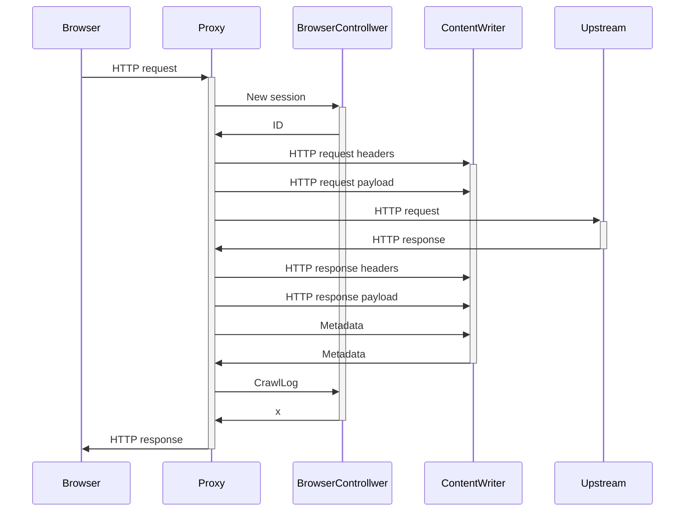

# veidemann-recorderproxy

```mermaid
sequenceDiagram
    Browser->>+Proxy: HTTP request
    Proxy->>+BrowserControllwer: New session
    BrowserControllwer->>Proxy: ID
    Proxy->>+ContentWriter: HTTP request headers
    Proxy->>ContentWriter: HTTP request payload
    Proxy->>+Upstream: HTTP request
    Upstream->>-Proxy: HTTP response
    Proxy->>ContentWriter: HTTP response headers
    Proxy->>ContentWriter: HTTP response payload
    Proxy->>ContentWriter: Metadata
    ContentWriter->>-Proxy: Metadata
    Proxy->>BrowserControllwer: CrawlLog
    BrowserControllwer->>-Proxy: x
    Proxy->>-Browser: HTTP response
```
